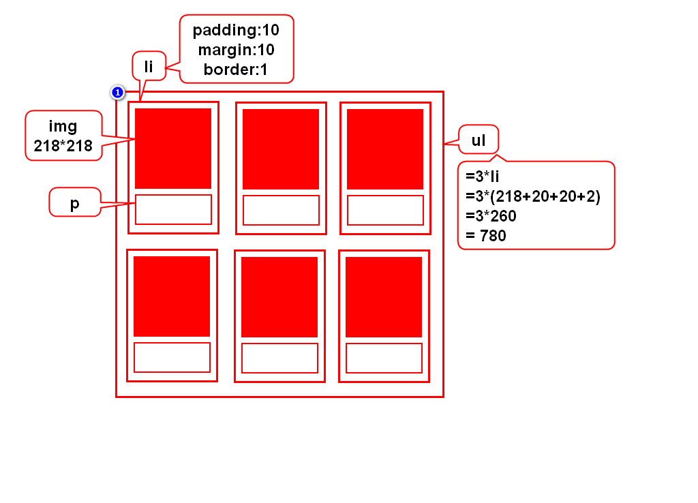
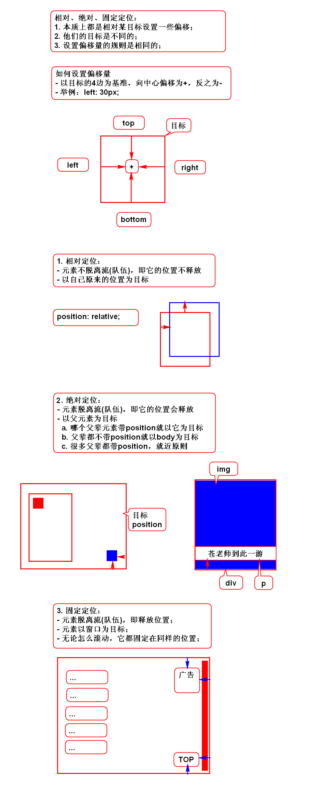
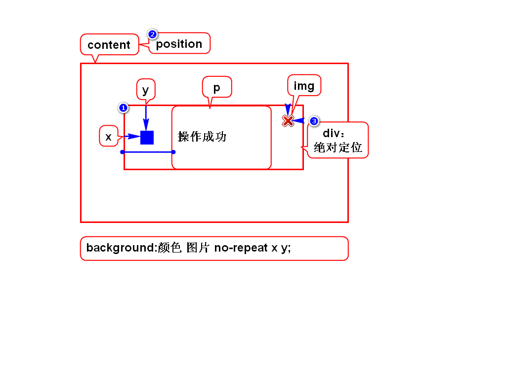

# 浮动

# 照片墙

# 相对、绝对、固定定位

# 定位的使用
## 1.固定定位
- 若需求要求元素固定在窗口上；
- 拖拽滚动条时该元素保持不动；

## 2.相对定位
- 若元素比原始位置偏移的很少；
- 元素的位置不释放，继续保留；

## 3.浮动
- 想让块元素左右排列；
- 想让元素定位在父元素左上方/右上方；

## 4.绝对定位
- 若上述定位都解决不了问题，则绝对定位

# 消息框

# 元素的显示方式
## 1.块
- 垂直排列，有宽高
- hn/p/ol/ul/div/table

## 2.行内
- 水平排列，无宽高
- span/i/em/b/strong/u/del/a

## 3.行内块
- 水平排列，有宽高
- img/input/select/textarea

## 归纳
- 满足对应特点的元素，就是对应显示方式
- 通过display可以修改元素的显示方式
- block/inline/inline-block/none