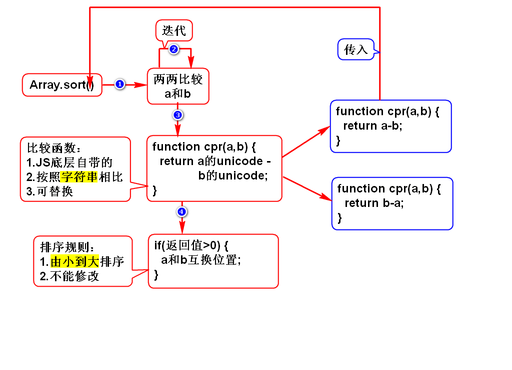
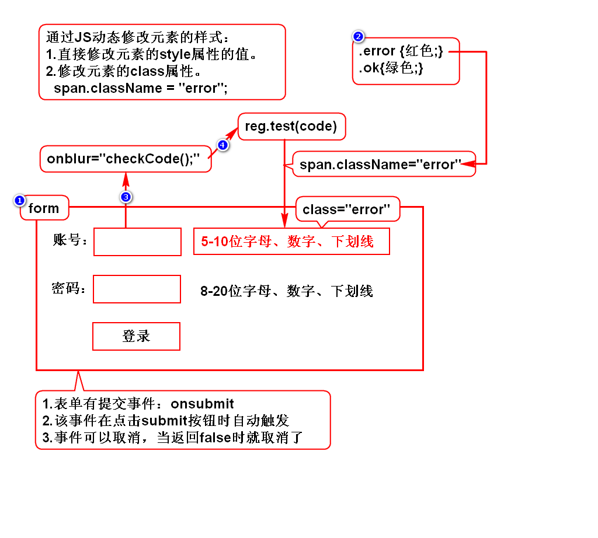
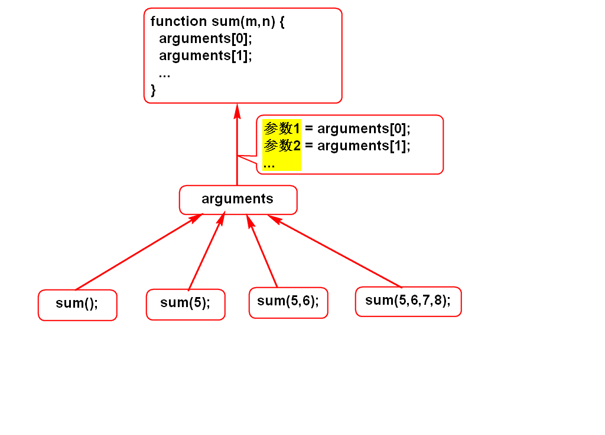

# w3c网站
- www.w3school.com.cn
- doc.tedu.cn

# 数组排序

# 登录验证

# arguments

# 回顾
## 基本语法
### 1.JS使用方式
1. 事件定义式：直接在元素上写JS。
2. 嵌入式：在script标签里写JS。
3. 文件调用式：在js文件中写JS。

### 2.JS基本语法
1. JS变量没有类型，都是var
2. 数据有类型：特殊、内置、外部、自定义
3. toString()/parseInt()/parseFloat()/isNaN()/typeof()
4. JS中的条件可以是任意数据，一切为空的值都是false

## 2.内置对象
### String
- 基本上和Java一样

### Number
- toFixed(n)

### Array(***)
- 创建：[], new Array()
- 反转：reverse()
- 排序：sort([function])

### Math
- 和java中的Math类似

### Date
- new Date() / new Date("")
- toLocaleDateString() / toLocaleTimeString()
- 读写时间分量：getXXX 或 setXXX

### RegExp(***)
- /reg/g;
- 正则的方法(***)：reg.test(str)
- 字符串方法(*)：str.replace(reg, "")

### Function(***)
- arguments的作用及原理(**)
- eval() (**)